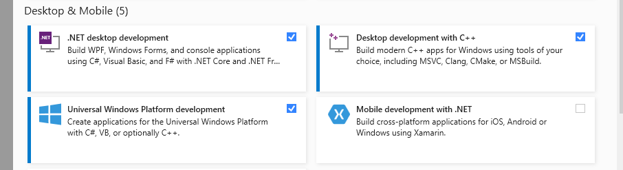

# Windows Desktop Application using C#
This is a Windows Desktop Application using WinForms ,  C# Programming languages , DotNet-Framework and Microsoft Sql-Server .

# Funtionalities
This Desktop Application can save Login Id , Bank details , Passengers details and Journey details .
Retrieve All saved information for perticular passenger and Open a new Form Window for that with all Info. Loaded

# Next Goal
Next goal for this project is to Automate the Railway Ticket Process using Automation Frameworks like Selenium or others .

# Tech & Tools Used
* #### Visual Studio ( With Installed Supported Packages for .Net)
* 

* #### C# Programming Language

* #### .Net Framework 4.7.2

* #### WinForms (Windows Forms)

* #### Microsoft-SQL Server 2019
